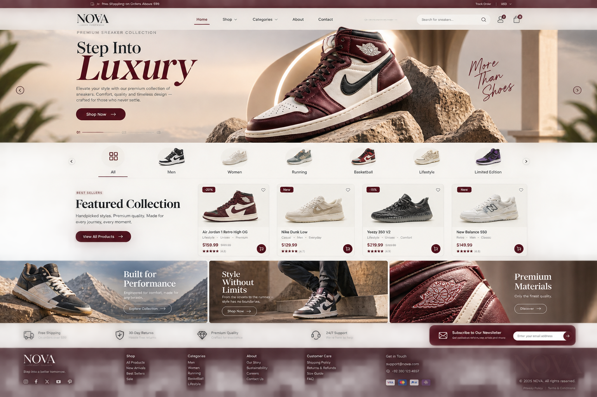

A premium, responsive luxury sneaker storefront built with HTML, CSS, and vanilla JavaScript. The project is designed as a modern front-end e-commerce experience for sneaker enthusiasts, combining editorial-style visuals, product discovery, cart flows, and a polished luxury brand aesthetic.



## Overview

NOVA is a static storefront website focused on high-end sneaker retail. It presents a luxury product catalog, category navigation, product filtering, detailed product views, a shopping cart, checkout flow, and support pages like FAQ, journal, and contact.

This project is ideal for showcasing how a premium fashion/e-commerce landing page can be structured without needing a complex backend.

## What this website includes

- Luxury homepage with a 3-slide editorial hero section
- Product category navigation and filters
- Dynamic product cards with prices, ratings, and quick actions
- Product detail page with size and quantity selection
- Shopping cart and order summary flow
- Checkout page with shipping and payment UI
- Authentication page for sign in / sign up
- FAQ and policy-related informational pages
- Contact, about, and journal sections
- Responsive design for mobile, tablet, and desktop screens
- Local cart persistence using browser localStorage
- Currency switcher and search-style UX

## What this website does not include

- A real backend or database
- Actual payment processing with live card charging
- Real user authentication and account storage
- Order management system or admin dashboard
- Inventory reservation or live stock tracking
- Live shipping or payment gateway integration

> This is a front-end demo project designed to simulate a luxury e-commerce experience, not a production-ready online store.

## Main pages

- index.html — Homepage with hero banner, collection, categories, and featured products
- shop.html — Product catalog/shop page
- categories.html — Category overview page
- category-men.html — Men category page
- category-women.html — Women category page
- category-running.html — Running category page
- category-basketball.html — Basketball category page
- category-lifestyle.html — Lifestyle category page
- product.html — Product information and purchase state
- cart.html — Shopping cart summary
- checkout.html — Checkout form and payment interface
- auth.html — Sign in / sign up page
- track-order.html — Order tracking page
- about.html — Brand story page
- journal.html — Editorial content page
- contact.html — Contact form page
- faq.html — Customer support information
- order-success.html — Success confirmation page
- policy pages — return, refund, cancellation policies

## Tech stack

- HTML5
- CSS3
- JavaScript (vanilla)
- Bootstrap utility classes
- Bootstrap Icons
- Google Fonts
- Unsplash images for product/editorial photography

## Project structure

```text
NOVA-Luxury/
├── assest/                  # Brand assets, logos, payment icons, preview image
├── about.html
├── auth.html
├── cancelation-policy.html
├── cart.html
├── categories.html
├── category-basketball.html
├── category-lifestyle.html
├── category-men.html
├── category-running.html
├── category-women.html
├── checkout.html
├── contact.html
├── faq.html
├── index.html
├── journal.html
├── order-success.html
├── product.html
├── refund-policy.html
├── return-policy.html
├── script.js
├── shop.html
├── style.css
├── track-order.html
├── README.md
├── README.txt
```

## How to run

### Option 1: Open directly in a browser

Open the project folder and double-click `index.html`.

### Option 2: Use a local static server

From the project folder, run any static server such as:

```bash
python -m http.server 8000
```

Then open:

```text
http://localhost:8000
```

## Sanity product catalog

The storefront reads published products from a public Sanity dataset and keeps the built-in catalog as a fallback. Product fields include name, slug, category, prices, image, label, rating, description, and sort order.

1. The NOVA Sanity project is configured with project ID `qdlqona2` and the public-read `production` dataset.
2. In Sanity project API settings, allow the local site origin (for example `http://localhost:8000`) and the deployed site origin. Public read access is required; do not enable credentialed CORS.
3. In a terminal, install and start the Studio. The admin opens at `http://localhost:3333/admin`; choose Google, GitHub, or E-mail / password on the Studio login screen:

	```bash
	cd sanity-studio
	npm install
	npm run dev
	```

4. To copy the current local products into Sanity once, create a write token in Sanity settings and run this in PowerShell from `sanity-studio`:

	```powershell
	$env:SANITY_PROJECT_ID = "your-project-id"
	$env:SANITY_API_WRITE_TOKEN = "your-write-token"
	npm run import-products
	```

	The token is used only by the local import command. Do not put it in storefront code or commit it.

After publishing products in Studio, refresh the storefront. Product links use Sanity slugs; the built-in catalog remains visible if the project ID is not configured or the dataset cannot be reached.

## Notes and limitations

- Product and editorial images are loaded from external Unsplash URLs, so an internet connection is required for those visuals to appear correctly.
- Cart, account data, and newsletter interactions are stored in browser localStorage for demo purposes.
- The checkout experience is front-end only and is not connected to a live commercial payment gateway.
- For live order email forwarding, the project uses a static form approach and may require external setup such as FormSubmit or another service.

## Brand identity

NOVA is positioned as a luxury, performance-driven footwear brand that blends premium materials, modern design, and lifestyle storytelling. The visual language includes a rich neutral palette, editorial typography, and a clean premium storefront structure.

## Conclusion

This project delivers a polished luxury shopping experience as a front-end prototype. It is well suited for portfolio presentation, concept validation, and e-commerce UI demonstrations, while clearly indicating that real backend functionality and payment processing are not implemented in the current version.
